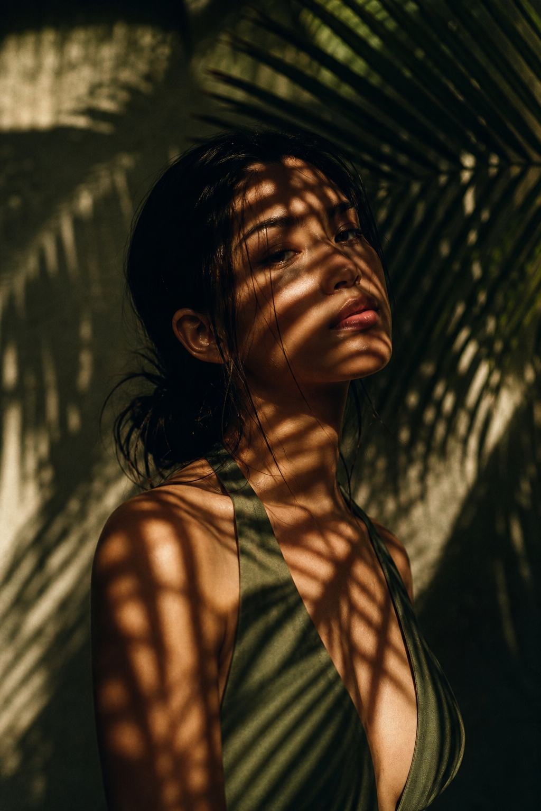
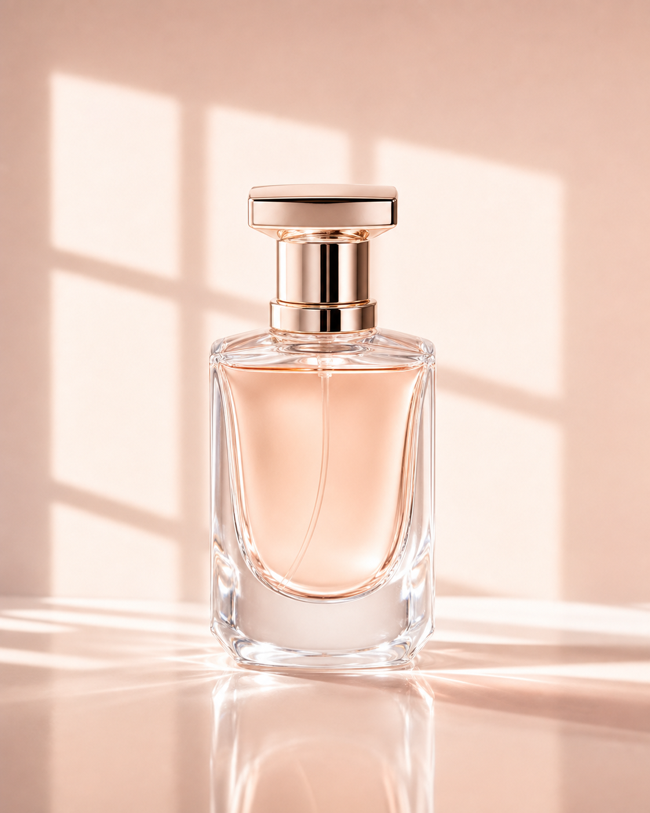
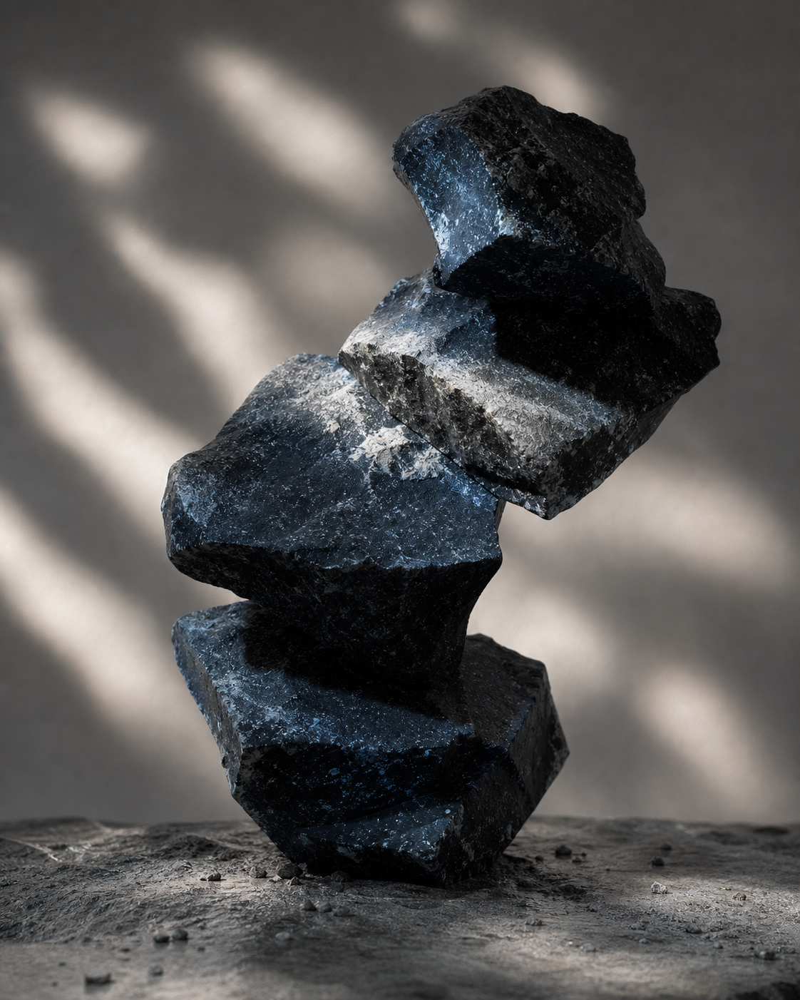
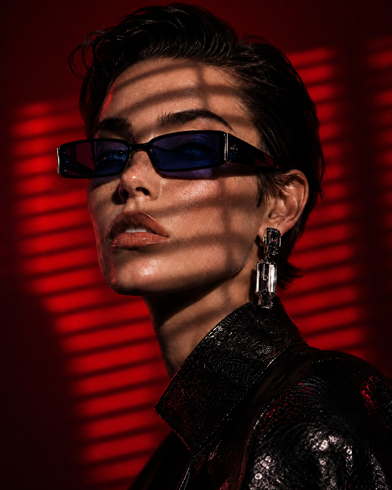

# Dramatic Gobo Lighting

中文说明见 [README.md](./README.md).

This is a Codex skill for adding dramatic projected gobo lighting to existing images or newly generated scenes.

This repository includes:

- the skill instructions
- the gobo selector script
- optimized bundled gobo assets
- tag-based controls for background locking, angle randomization, edge softness, and projection scale

Supported controls include:

- whether the background should stay locked
- whether the light angle should vary
- how sharp or soft the light edges should be
- how large the gobo projection should appear

## What This Skill Does

It works well for effects like:

- window light
- venetian blind shadows
- plant leaf shadows
- caustic water reflections
- graphic line projections
- abstract broken light

Its main goal is not to redesign the subject itself, but to reshape the lighting mood while preserving the original structure of the image as much as possible.

## Directory Structure

```text
dramatic-gobo-lighting/
├─ README.md                         ← Chinese usage guide, default repository landing page
├─ README.en.md                      ← English usage guide
├─ README.zh-CN.md                   ← Chinese alias page for old links
├─ LICENSE                           ← GPL-3.0 license
├─ SKILL.md                          ← Main skill instructions used by Codex
├─ agents/
│  └─ openai.yaml                    ← Skill agent configuration
├─ references/
│  ├─ gobo-library.md                ← Gobo family notes and usage guidance
│  ├─ gobo-catalog.md                ← Full gobo filename catalog
│  └─ gobo-name-quick-lookup.md      ← Quick filename lookup page
├─ scripts/
│  └─ select_gobo.ps1                ← PowerShell selector script for matching gobos
└─ assets/
   ├─ examples/                      ← Example images displayed in the README
   │  ├─ case-01-plants-portrait.png
   │  ├─ case-02-window-perfume.png
   │  ├─ case-03-abstract-rock.png
   │  └─ case-04-blinds-fashion-red.png
   └─ gobos/
      ├─ abstract/                   ← Abstract broken light patterns
      ├─ caustics/                   ← Water-reflection caustic patterns
      ├─ lines/                      ← Linear / graphic projection patterns
      ├─ plants/                     ← Plant shadow patterns
      └─ windows/                    ← Window and venetian blind patterns
```

## Install

### Method 1: One-Line Install (Recommended)

```bash
git clone https://github.com/Mixiaxiaoyu/dramatic-gobo-lighting.git ~/.codex/skills/dramatic-gobo-lighting
```

Once this finishes, the skill will be installed into your local Codex skills directory.

### Method 2: Send This Directly To Codex

> Install the `dramatic-gobo-lighting` Codex skill for me by following these steps:
>
> 1. Make sure the `~/.codex/skills/` directory exists. Create it if it does not.
> 2. Run `git clone https://github.com/Mixiaxiaoyu/dramatic-gobo-lighting.git ~/.codex/skills/dramatic-gobo-lighting`
> 3. Verify that `~/.codex/skills/dramatic-gobo-lighting/` contains `SKILL.md`, `assets/`, `references/`, and `scripts/`.
> 4. Tell me when the installation is complete. After that, whenever I ask for gobo lighting, window light, blinds shadows, or water-caustic effects, prioritize this skill.

You can copy that block directly into Codex or another AI agent with shell access and it should usually complete the installation automatically.

### Method 3: Manual Install

1. Clone the repository locally, or download the ZIP and extract it:

```bash
git clone https://github.com/Mixiaxiaoyu/dramatic-gobo-lighting.git
```

2. Move or copy the entire `dramatic-gobo-lighting` folder into:

```text
~/.codex/skills/dramatic-gobo-lighting
```

Typical Windows path:

```text
C:\Users\<your-username>\.codex\skills\dramatic-gobo-lighting
```

3. After installation, confirm that at least these items exist:

```text
SKILL.md
assets/
references/
scripts/
```

4. If you want a quick local test, run this from the repository root:

```powershell
powershell -ExecutionPolicy Bypass -File .\scripts\select_gobo.ps1 -Brief "moody noir portrait with blind shadows"
```

## Prompt Tags

You can place these tags directly inside the user prompt and the skill will prioritize them.

### 1. Background Control

```text
@gobo-bg: lock
@gobo-bg: free
@gobo-bg: auto
```

- `lock`
  - Keeps the background color, structure, and layering stable.
  - Good for branded backgrounds, 3D renders, UI-heavy scenes, or complex subjects.

- `free`
  - Lets the background shift darker, warmer, cooler, or moodier to support the lighting atmosphere.
  - Good for more poster-like or emotionally driven images.

- `auto`
  - Lets the skill decide automatically.
  - By default it leans toward stability.

### 2. Light Angle Control

```text
@gobo-angle: fixed
@gobo-angle: random
@gobo-angle: auto
```

- `fixed`
  - Uses a more stable and conservative projection direction.
  - Good for product shots, complex 3D scenes, and visually dense compositions.

- `random`
  - Adds controlled variation to light direction and projection placement.
  - Good for exploration and quick mood variation.

- `auto`
  - Lets the skill choose automatically.

### 3. Edge Softness

```text
@gobo-edge: crisp
@gobo-edge: soft
@gobo-edge: diffuse
@gobo-edge: soft*2
@gobo-edge: diffuse*2
@gobo-edge: auto
```

- `crisp`
  - Hard edges with clear shadow definition.
  - Good for strong sunlight, blinds, and architectural lighting.

- `soft`
  - Slightly softens the edges while keeping the pattern readable.

- `diffuse`
  - Creates a more visibly softened and hazy edge transition.

- `soft*2`
  - One step softer than regular `soft`.

- `diffuse*2`
  - One step softer than regular `diffuse`.
  - Good for very gentle, blended transitions.

- `auto`
  - Lets the skill decide automatically.

### 4. Projection Scale

```text
@gobo-scale: 0.75
@gobo-scale: 1.0
@gobo-scale: 1.5
@gobo-scale: 2.0
@gobo-scale: 2.5
```

This does not change image resolution. It changes how large the projected pattern appears inside the composition.

- Larger values
  - create larger shapes
  - reduce repetition
  - make it easier for the pattern to affect only part of the frame

- Smaller values
  - create denser patterns
  - increase repetition
  - make it easier for the pattern to cover a wider area

### 5. Manual Gobo Selection

```text
@gobo-file: GSG_Gobos_Windows_Blinds_07.jpg
@gobo-file: GSG_Gobos_Caustics_Caustics_02.jpg
```

Copy the exact filename from [references/gobo-catalog.md](./references/gobo-catalog.md).

If this tag is present, it overrides automatic selection and forces that exact gobo reference.

Quick lookup links:

- [Gobo Name Quick Lookup](./references/gobo-name-quick-lookup.md)
- [Full Gobo Filename Catalog](./references/gobo-catalog.md)

## Example Gallery

These four examples show typical directions for this skill: plant shadows, window light, abstract broken light, and venetian blind shadows.

### Example 1: Plant-Shadow Portrait

Best family: `Plants / Palm`



### Example 2: Window-Light Product Shot

Best family: `Windows / Window`



### Example 3: Abstract Broken-Light Still Life

Best family: `Abstract`



### Example 4: Venetian-Blinds Fashion Portrait

Best family: `Windows / Blinds`



## Recommended Prompt Examples

### Image Edit / User Uploads an Image

#### Keep the Background Completely Unchanged

```text
@gobo-bg: lock @gobo-angle: fixed @gobo-edge: soft
Add dramatic window projection light to this render while keeping the background completely unchanged.
```

#### Allow the Background to Become Moodier

```text
@gobo-bg: free @gobo-angle: fixed @gobo-edge: diffuse
Add more cinematic window-shadow lighting to this image and allow the background atmosphere to become slightly darker.
```

#### Let the Gobo Affect Only Part of the Frame

```text
@gobo-bg: free @gobo-angle: fixed @gobo-edge: soft @gobo-scale: 2.0
Add a larger localized window-light event so the light only lands on one side of the composition.
```

#### Try a Different Light Direction Each Time

```text
@gobo-bg: lock @gobo-angle: random @gobo-edge: soft
Keep the subject stable but explore different usable gobo lighting directions.
```

#### Force One Specific Gobo

```text
@gobo-bg: lock @gobo-angle: fixed @gobo-file: GSG_Gobos_Windows_Blinds_07.jpg
Use this exact venetian-blinds gobo on the uploaded render and keep the background unchanged.
```

### Text-to-Image / No Source Image

#### Generate a Venetian-Blinds Fashion Portrait

```text
@gobo-bg: free @gobo-angle: fixed @gobo-edge: crisp
A cinematic fashion portrait of a woman in a dim hotel room, with clear venetian blind shadows across the wall and shoulder, strong sunlight, low ambient fill, and a luxury editorial mood.
```

#### Generate a Softer Beauty Portrait with Plant Shadows

```text
@gobo-bg: free @gobo-angle: random @gobo-edge: diffuse
A clean beauty portrait with soft tropical leaf-shadow lighting across the face and background, warm afternoon sunlight, luminous highlights, and a premium skincare campaign look.
```

#### Generate a Product Shot with a Large Local Window Pattern

```text
@gobo-bg: free @gobo-angle: fixed @gobo-edge: soft @gobo-scale: 2.0
A premium perfume bottle on a stone pedestal, with a large localized window-light projection illuminating only one side of the set, elegant shadows, and a luxury still-life photography style.
```

#### Generate a Soft Water-Caustics Scene

```text
@gobo-bg: free @gobo-angle: random @gobo-edge: diffuse*2
A sculptural skincare bottle in a sunlit spa setting, with very soft water-caustic reflections across the wall and surface, humid air, and a calm luxurious atmosphere.
```

#### Generate Using One Exact Gobo File

```text
@gobo-bg: free @gobo-angle: fixed @gobo-file: GSG_Gobos_Caustics_Caustics_02.jpg
A premium skincare bottle in a quiet spa room, built around this exact caustics gobo pattern, with soft reflected water light on the wall and an elegant quiet-luxury mood.
```

## Default Behavior

If the user does not provide any fixed tags, the skill defaults to:

```text
@gobo-bg: auto
@gobo-angle: auto
@gobo-edge: auto
@gobo-scale: 1.0
```

In practice:

- complex images lean more conservative and stable
- simpler images allow stronger atmospheric changes
- overall behavior still follows a preservation-first approach, protecting the original subject, layout, materials, and recognizable elements
